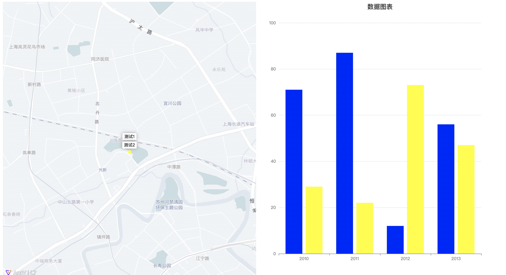

# map-charts




## Project setup

```
yarn install
```

### Compiles and hot-reloads for development

```
yarn serve
```

### Compiles and minifies for production

```
yarn build
```

## MapCharts 组件

### Props

```js
{
    longitude: Number, // 中心位置（可响应）
    latitude: Number, // 中心位置（可响应）
    defaultGaodeConfig: { // 高德地图默认配置，可以查阅高德地图的文档
      type: Object,
      default: () => ({
        pitch: 0, // 倾斜度
        style: "light", // 主题
        center: [121.435159, 31.256971], // 中心点
        zoom: 14.89, // 默认缩放
        minZoom: 10, // 最小缩放
        token: '' // 高德地图的token
      }),
    },

    markers: { // 标记点列表
      type: Array,
      default: () => [
      /**
       * id // 如果使用value的话必须设置
       * text // 文本
       * color // 颜色
       * serie // 图表数据，可以使用onLoadSerie来实现异步加载
       * longitude // 位置
       * latitude // 位置
       */
      ],
    },
    value: Array, //选中ID列表 可以双向绑定

    chartsTitle: String, // 图表标题（可响应）
    xAxisData: Array, // 图表X轴，对应echarts的option.xAxis.data（可响应）
    onLoadSerie: { // 异步加载图表函数，必须返回echarts的Serie类型数据
      type: Function,
      default: (data) => data.serie,
    },
}
```

### Methods

```js
updateCharts(); // 更新图表方法
```
